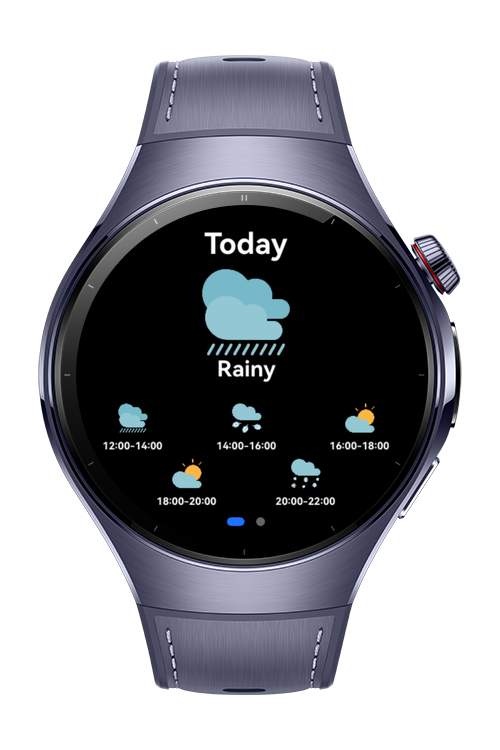

> **Note:** To access all shared projects, get information about environment setup, and view other guides, please visit [Explore-In-HMOS-Wearable Index](https://github.com/Explore-In-HMOS-Wearable/hmos-index).

# How to use Background Tasks Kit?

This project demonstrates an application that fetches and displays the daily weather forecast, periodically updating the data in the background based on optimal system conditions. By leveraging deferred tasks, the app ensures that weather information remains accurate without compromising system performance or user experience—particularly important for resource-constrained environments such as wearable devices.

# Preview

<p align="left">
  
  
</p>

# Use Cases

- Display the current weather and daily forecast to the user.
- Automatically update weather data in the background without draining battery. 
- Ensure timely and accurate weather information on devices with limited resources.
- Adapt background updates based on optimal system conditions to maintain performance.

# Tech Stack

- **Languages**: ArkTS, ArkUI
- **Frameworks**: HarmonyOS SDK 5.0.2(18)
- **Tools**: DevEco Studio Vers 5.1.0.842
- **Libraries**:
- `@kit.ArkUI`,
- `@kit.BasicServicesKit`,
- `@kit.PerformanceAnalysisKit`,
- `@kit.AbilityKit`,
- `@kit.BackgroundTasksKit`

# Directory Structure

   ```
Weather_Forecast/
└── entry/
    └── src/
        └── main/
            ├── ets/
            │   ├── components/
            │   │   └── WeatherPage.ets
            │   ├── data/
            │   │   └── service/
            │   │       └── WeatherService.ets
            │   ├── entryability/
            │   │   └── EntryAbility.ets
            │   ├── entrybackupability/
            │   │   └── EntryBackupAbility.ets
            │   ├── models/
            │   │   └── WeatherModels.ets
            │   ├── pages/
            │   │   └── Index.ets
            │   ├── task/
            │   │   └── TaskManager.ets
            │   ├── viewmodel/
            │   │   └── WeatherViewModel.ets
            │   └── weatherworker/
            │       └── WeatherWorker.ets
            └── module.json5
   ```

# Constraints and Restrictions
## Supported Devices

- Huawei Watch 5

# LICENSE

This project distributed under the terms of the MIT License.
See the [license](/LICENSE) for more information.